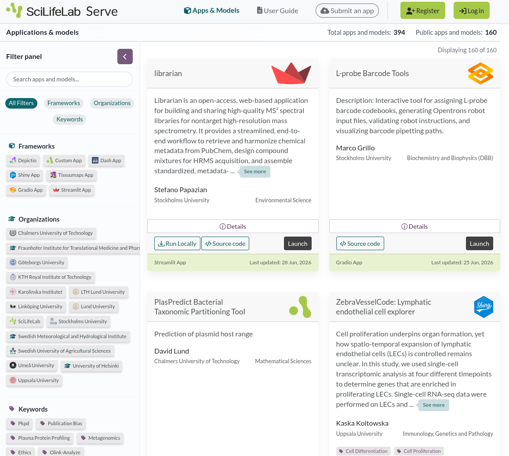

# Introduction

As part of the INTOXICOM Implementation Study for the ELIXIR Toxicology Community a series of workshops is organized [@citesAsRecommendedReading:citesAsEvidence:Martens2024INTOXICOM]. Here, we here report on the 3rd workshop, titled "Making toxicology tools more accessible and interoperable"
which was held from 26 to 27 March 2025 at the SciLifeLab at Uppsala University in Sweden.

The workshop welcomed 29 participants from Sweden, The Netherlands, Cyprus, Switzerland,
Italy, Greece, France, and Norway. This 3rd INTOXICOM workshop covered various aspects of making computational tools available and how they are used. Several projects, such
as NanoSolveIT [@obtainsBackgroundFrom:Afantitis2020NanoSolveIT],
ONTOX [@obtainsBackgroundFrom:Vinken2021Safer],
and VHP4Safety [@obtainsBackgroundFrom:Kienhuis2024Virtual],
already make computational toxicology services available, but the field of integrating
computional toxicology dates back much longer, such as Bioclipse developed at Uppsala 
University [@obtainsBackgroundFrom:Willighagen2011Computational], making it a perfect
location to have held this workshop.

## Presentations

Organizers and invited speakers held several presentation to provide information to
support the workshop, scheduled as part of sessions hosted by Ola Spjuth and
Egon Willighagen:

| Speaker | Talk Title  |
| --- | -------- |
| Egon Willighagen | ELIXIR Introduction |
| Jonne Rietdijk | User perspective: Morphological Profiling for Chemical Toxicity Assessment |
| Ivo Djidrovski | Large Language Model tools and AI-Agents  in toxicology research |
| Antreas Afantitis | NovaMechanics platforms:  NanoSolveIT, Enalos Cloud, Pharos DMS |
| Ziye Zheng | Toxicity prediction with regulatory relevance: predicting the CLP H-statement |
| Egon Willighagen | Toxicity prediction with regulatory relevance: predicting the CLP H-statement [@citesAsEvidence:06willighagen] |
| Nikita Churikov | Sharing and serving ML models in toxicology research with SciLifeLab Serve |
| Jente Houweling | VHP4Safety project for data/tool integration |

# Results

## Day 1

After a *Welcome at SciLifeLab* by Ola Spjuth and an overview of ELIXIR Europe,
the INTOXICOM workshop, and the schedule of the workshop, the first session what
about *What tools for toxicology exist?*. The focus of this session was aimed
at relevant services indexed by the ELIXIR Toxicology Community on bio.tools
for computational tools and FAIRsharing for databases:

* [bio.tools records annotated with toxicology](https://bio.tools/t?page=1&q=%27Toxicology%27&sort=score)
* [FAIRsharing's toxicology collection](https://fairsharing.org/3496/)

The participants that several services were missing in the collection of 103
tools found in bio.tools, including [VHP4Safety services](https://cloud.vhp4safety.nl/),
[TXG-MAPr](https://txg-mapr.eu/), [BMDExpress](https://github.com/auerbachs/BMDExpress-3),
the [Enalos Cloud Platform](https://enaloscloud.novamechanics.com/all.html),
OPERA and VEGA, [EFSA tools](https://r4eu.efsa.europa.eu), and
https://www.parc-models.eu/tools/.

The FAIRsharing collection was already discussed at the second INTOXICOM workshop
[@citesForInformation:BonattoMinella2026INTOXICOM] and futher curated by Bonatto Minella
*et al.* [@citesForInformation:BonattoMinella2025]. During the workshop several
databases were found to be missing, including ToxVal, ToxRef, ToxCast,
[AOP-Wiki](https://aopwiki.org/), [ECHA CHEM](https://chem.echa.europa.eu/),
[Nanosafety Data Interface](https://enanomapper.adma.ai/), [GenRA](https://bio.tools/genra-py),
[chemPharos](https://db.chempharos.eu/datasets/Datasets.zul),
[RepDose Database Fraunhofer ITEM](https://repdose.item.fraunhofer.de/), and
[Le Portail Substances Chimiques (PSC)](https://substances.ineris.fr/le-portail-substances-chimiques).

In the afternoon, the second session consisted of three user stories on
data and tools in the session *How to make your data integrate with tools?*,
chaired by Ola. The first story was given by Jonne Rietdijk on morphological
profiling for chemical toxicity, proposed for toxicology testing in 2010 [@discusses:Krewski2010Toxicity]. Riedijk walked the participants through various
approaches, such as cell painting. Data was shared on Figshare [@discusses:Rietdijk2022],
comparing effects of exposure to cetyltrimethylammonium bromide, bisphenol A,
and bibutyltin dilaurate in several human cell lines. Images can be shared
with OMERO [@citesForInformation:Allan2012OMERO], which has advantages over
the more general Figshare.

The story provided by Ivo Djidrovski describes the rapid progress of large
language models (LLMs). His work focuses on using LLM agents capabilities,
which provide access to data and knowledge bases. He demoes the use of LLMs
in a chemical hazard assistant, based on the OECD QSAR Toolbox [@citesAsRecommendedReading:djidrovski2025qt].

After a break, Antreas Afantitis descrbes the NovaMechanics platforms
NanoSolveIT, Enalos Cloud, Pharos DMS, based on 20 years of experience in
the field. [Enalos cloud](https://novamechanics.com/services-tools/enalos-cloud-platform/)
enables non-expert users to leverage ML. Model outputs are accompanied by a
workflow of what the user has performed.
The [Nanopharos](https://pharos.novamechanics.com/) database integrates
experimental data with physics-based models and machine learning.

The last user story was provided by Ziye Zheng fo the IVL Swedish
Environmental Institute. It discussed [SafeChem](https://www.ivl.se/projekt/mistra-safechem.html), the regulatory relevance, lack of negative controls,
data mining from the ECHA REACH dossiers, and computational toxicology
approaches, including molecular descriptors, fingerprints, and descriptor-free
approaches, and comparing traditional machine learning and deep learning.

During the discussion at the end of this session, the workshop participants
identified several missing things (some gaps are filled by the wider
community in the year following the workshop): model context protocols (MCPs)
for toxicology, Open API definitions, clarity and/in documentation, also
for knowledge graphs, and better interoperability standards, for example,
with FAIR Implementation Profiles.

## Day 2

The second day started with the session *How can solutions complement your data?
Using tools in tox studies* with three presentations and an open discussion.
The first presentation was given by Egon Willighagen on how knowledge
bases give context to experimental data [@citesAsEvidence:06willighagen].
For toxicology, these may include
WikiPathways [@citesForInformation:Agrawal2023WikiPathways],
and AOP-Wiki [@citesForInformation:Martens2022Providing],
e.g. via the AOP-Wiki RDF. The importance of
knowledge bases is that they curate the collected scientific knowledge.
Bio2RDF gets a shout out for making knowledge bases interoperable
[@credits:Belleau2008Bio2RDF].

The second talk was given by Nikita Churikov of SciLifeLab on *Sharing and
serving ML models in toxicology research with SciLifeLab Serve*.
[Serve](https://serve.scilifelab.se/apps/) is an infrastructure for
bioinformaticians to publish open source codes (see Figure 1). The platform
uses Docker to make tools available, such as DICTrank Predictor
[@citesAsRelated:Seal2024Insights]. The talk further discussed exchange
of metadata and minimal reporting standards for tools and the
[Five recommandations for FAIR software](https://fair-software.eu/) and
the [Self-assessment for FAIR research software](https://fairsoftwarechecklist.net/)
come up.

The last talk in this session was given my Jente Houweling working at the
Dutch [National Institute for Public Health and the Environment](https://www.rivm.nl/).
She introduces the participants to the VHP4Safety project and her research
on the [ToxTempAssistant](http://toxtempassistant.vhp4safety.nl/)
[@citesForInformation:houweling2026toxtempassistant] in particular. This
tool uses large language models to support filling out ToxTemp templates,
aimed at providing sufficient details on experimental toxicology data
[@citesForInformation:Krebs2019Template].

# Discussion

All sessions has many lively discussions with a lot more pointers and actions.
Of particularly interest is the interest in using the interoperability that
toxicologists have worked on over the years to enable LLMs to interface with
knowledge bases and tools. This interest is shared by many, and ELIXIR Europe
now has an [AI Ecosystem Focus Group](https://elixir-europe.org/focus-groups/ai-ecosystem), which includes two task forces, one on agentic AI and
the other on generative AI.

Participants expressed concern about how and to which extent in silico tools should and can be validated, including tools that implement LLM models. Traceability of the training data, in particular that used for complex models should be ensured so that this data is not used, at later stages of model interoperability, to evaluate model or tool performance

Another important point is that finding tools and knowledge bases is a
continuous activity, and the Toxicology Community will continue have to be
active in ensuring they are easily found (as part of FAIR). During the
workshop several tools and databases were identified which were not found
in bio.tools of FAIRsharing at the time, and they need to be added.
Platforms like VHP4Safety, NanoSolveIT, and SciLifeLab Serve should make
metadata interoperable, e.g. with BioSchemas.

## Funding

This workshop was funded by the ELIXIR Europe INTOXICOM grant (Grant No. NL-2023-INTOXICOM).

Participants acknowledge funding from the French Ministry in charge of Ecology within Programme 190.

## References
